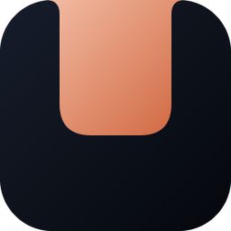
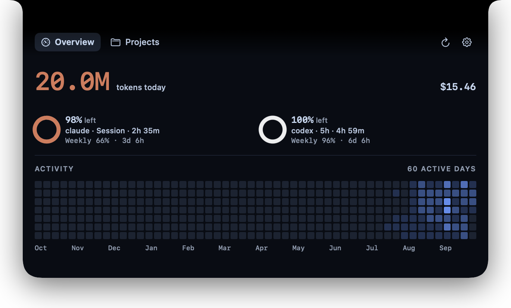
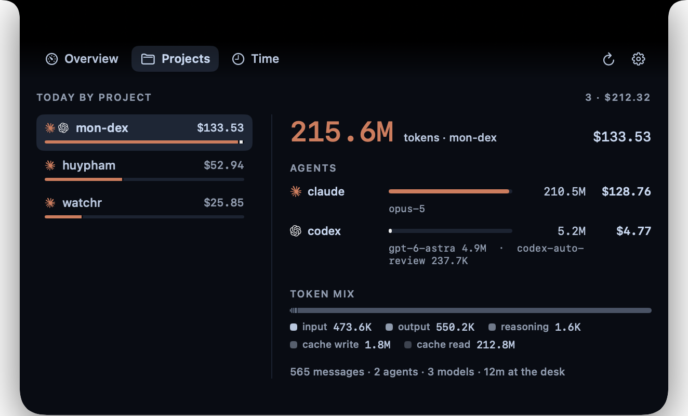
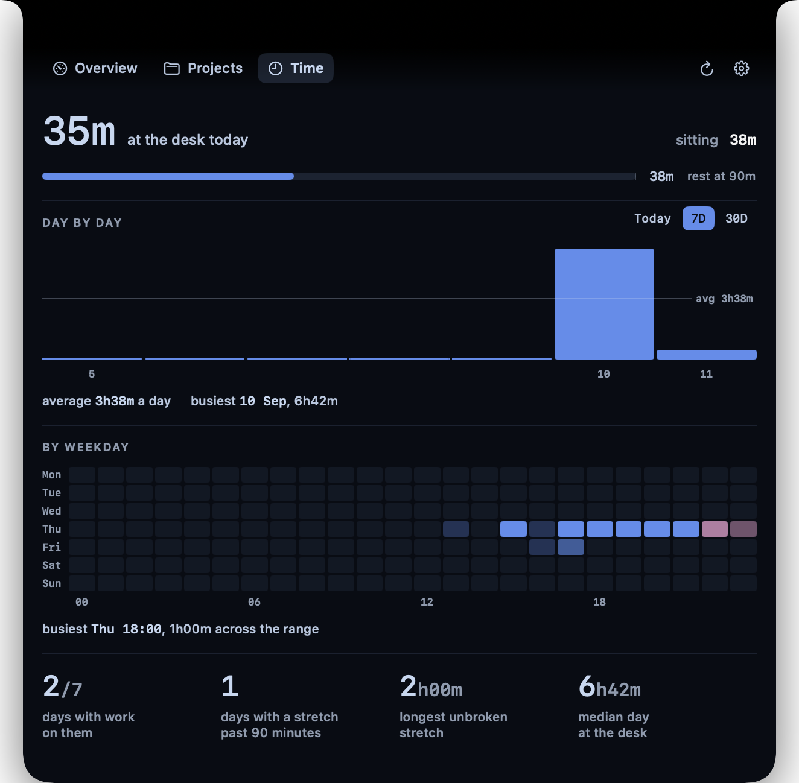
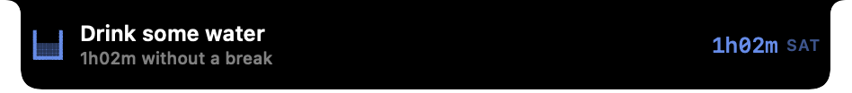
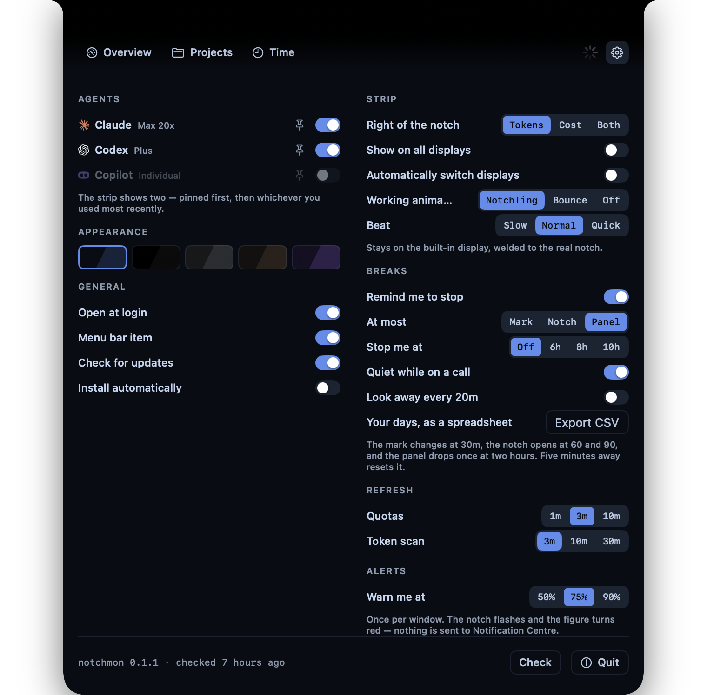

<div align="center">



# notchmon

**How much quota each AI coding agent has left, what today cost, and how long you have
been sitting there — drawn into the MacBook's own notch.**


</div>

## What is notchmon?

One glance, no window: how much of each agent's quota is left, what today has
cost, and how long you have been at the desk without a break. It lives in the two
menu-bar strips either side of the camera housing. Hover it and the notch grows
downward into a panel.

Most Mac usage trackers read one tool. notchmon has **no built-in list of agents
at all** — it reads whatever [`tokscale`](https://github.com/junhoyeo/tokscale)
can find on the machine, which today is 53 clients. You only ever see the ones
you actually use.

> The screenshot above cannot show the notch, because the notch is not pixels —
> it is a hole cut for the camera. On the machine, the gap in the middle of that
> strip is the camera housing, and the strip reads as passing behind it. See
> [design notes](docs/notes.md) for how that illusion is held together.

## Supported agents

`claude` · `codex` · `cursor` · `gemini` · `copilot` · `opencode` · `amp` ·
`droid` · `kimi` · `qwen` · `crush` · `goose` · `zed` · `warp` · `cline` ·
`grok` · `augment` · `devin-cli` · `junie` · `trae` · `kiro` — and 32 more.

<details>
<summary>All 53</summary>

`amp`, `antigravity`, `antigravity-cli`, `augment`, `cherrystudio`, `claude`,
`cline`, `codebuddy`, `codebuff`, `codex`, `commandcode`, `copilot`, `crush`,
`cursor`, `devin-cli`, `devin-desktop`, `droid`, `dsh`, `freebuff`, `fx`,
`gemini`, `gjc`, `goose`, `grok`, `hermes`, `hindsight`, `jcode`, `junie`,
`kilo`, `kilocode`, `kimchi`, `kimi`, `kiro`, `lmstudio`, `mcode`, `micode`,
`mux`, `omp`, `openclaw`, `opencode`, `opencodereview`, `pi`, `prime-agent`,
`qwen`, `reasonix`, `roocode`, `senpi`, `trae`, `unsloth`, `warp`, `workbuddy`,
`zcode`, `zed`

</details>

When tokscale learns a 54th, it appears with no update to notchmon and no code
change here. A test pins that behaviour
(`ProjectFoldTests.testAnUnknownAgentStillAppears`), because it is the one
property that would be easy to break and hard to notice.

## Showcase

**Overview** — today's tokens and cost, a dial per agent showing what is left of
the window that runs out soonest, and a year of activity.



**Projects** — today's spend split by repository, then by agent, then by model,
with the token mix underneath. Cache reads are usually most of the volume, and a
bare token count hides that. The last line carries the join: how long you were
at the desk on this project, and what an hour of it cost.



**Time** — how long today ran, when it ran, and how long the longest unbroken
stretch was. The strip carries the same figure all day, so the third hour is not
a surprise at the end of it. Past a week it also draws the weekday grid: which
hours of which days the work actually happens in.



**Breaks** — the reminder that scales with the risk. At thirty minutes the mark
beside the figure changes and nothing opens; at an hour the notch itself grows
for a few seconds and takes itself away.




**Settings** — in the notch, not a window. Pin agents to the strip, choose one of
five themes, set the refresh clocks, pick the alert threshold, and decide whether
the app may interrupt you at all.



## Features

**Quota**
- Every provider's session and weekly windows, with the time until each resets.
- The ring shows whichever window **runs out soonest in wall-clock time**, not
  the fullest one — a 7-day at 84% and a 5-hour at 89% say nothing about which
  you hit first.
- A **pace** projection: which way the window is moving, what share the current
  rate will have spent by reset, and when it runs out if that lands past 100%.
- One alert per window at 50 / 75 / 90%. The notch flashes; nothing is sent to
  Notification Centre.

**Today**
- Tokens and cost, per agent and per model.
- Per project, with input / output / cache-write / cache-read split out.
- A year of daily activity, in the theme's own colour.

**Time at the desk**
- Presence is *sensed*, not assumed: HID idle time, the lock and console state,
  and whether the display is even awake. An agent working buys you a longer
  think before you count as gone.
- **Evidence, never a span.** Each tick is proof somebody was there, and a gap
  between ticks is an absence whether or not the machine said it was sleeping —
  which is what stops a lid closed overnight reading as a nine-hour sit.
- A bar per clock hour for today, a bar per day over 7 or 30, with the hours
  after 22:00 marked in their own colour and a hover card on every bar.
- Longest unbroken stretch, how many separate sits, first at the desk, last seen.
- **Hours by project**, joined to what those hours spent: the scan knows the
  money and the presence clock knows who was there, so the page can say what an
  hour at the desk cost. It needs no new permission — every client puts the
  workspace in or beside the session file the app already watches.
- A weekday-by-hour grid over 7 or 30 days, built from buckets the history
  already keeps, so it cannot drift out of step with the charts above it.
- Two CSVs — a row per day with the twenty-four buckets, and a long file of
  project hours that names the unattributed remainder rather than dropping it.

**Breaks**
- Thirty minutes changes the mark and opens nothing. Sixty and ninety open the
  notch itself for a few seconds. Two hours drops the panel once, onto the Time
  tab — a panel that opens by itself should show its evidence.
- Thirteen pixel sprites on the same 11×11 grid as everything else in the strip:
  coffee, water, a snack, a walk, a stretch, an eye, a book, a handheld.
- The mark announces itself for three loops and then moves once every forty
  seconds. Continuous motion for three hours is what gets a feature switched
  off; no motion at all is not seen, because peripheral vision reports change
  rather than state.
- Nothing waits to be dismissed. Every reminder takes itself away.
- A block that ended is summarised **when you come back**, not when you leave:
  writing it at the end would be writing it to an empty chair. Half an hour
  away, twenty-five minutes of work, or it says nothing.
- A figure for the day, if you set one. Off by default — a number the app chose
  would be the app having an opinion about your working day.
- It stands down while the microphone is in use, which is the only "bad moment"
  macOS will report without being asked for a permission. A rung reached during
  a call is not spent on it: it stays due and whatever is current fires when the
  call ends, so the reminder never arrives saying the wrong number.
- **One switch in Settings turns all of it off, and it is on by default.** It
  changes nothing else: the Time tab still counts and the strip still says how
  long you have been sitting. Measuring and interrupting are two different
  consents, and only the second one is annoying. Under it, the loudest size
  allowed is a choice too.
- The intervals are not taste. They come from Diaz's 2023 trial, the 2015
  sedentary-office statement, Directive 90/270's working benchmark, and
  Albulescu's 2022 micro-break meta-analysis — all four cited in
  [docs/notes.md](docs/notes.md), along with the three sources that were read and
  deliberately not used.

**In the notch**
- A pixel sprite runs in an agent's mark while that agent is working — detected
  from session files on disk, not from a hardcoded list of processes. Two styles,
  adjustable beat, or off.
- Five themes: Ink, Obsidian, Anodized, Sable, Vapor.
- Stands down while Mission Control is up, and leaves entirely while an app is
  full screen — on that display only, so a full-screen browser on an external
  monitor does not blank the strip on the MacBook.
- Follows the display you are working on, or shows one strip per display.

## Install

Download the latest **`.dmg`** from
[Releases](https://github.com/huynextlevel/notchmon/releases), open it, and drag
notchmon to Applications.

The app is signed with a Developer ID certificate and notarized by Apple, so it
opens with a double-click — no right-click-Open, no Gatekeeper warning.

## Requirements

- macOS 14 or later
- A MacBook with a notch. notchmon pins itself to the display that has one
  rather than to whichever screen has focus, and will not draw an invented notch
  on a screen without one.
- Apple silicon or Intel — the build is universal, and so is the tokscale binary
  inside it.

## Updates

Two switches in Settings, because they grant two different things: knowing a
version exists, and letting the app replace itself without being asked.

Updates go through [Sparkle](https://sparkle-project.org) and are verified twice
over — an EdDSA signature whose public half is baked into every copy already
installed, plus Apple code signing.

## Privacy

Everything stays on the machine. notchmon spawns `tokscale` as a subprocess,
which reads credentials and session files already on disk (`~/.claude`,
`~/.codex`, the keychain). The app itself stores nothing beyond its own settings
and a local history of quota readings, and sends nothing anywhere.

The only network traffic it makes on its own is the update check, and only while
that switch is on.

Time at the desk is measured with **no permission prompt of any kind** — no
Accessibility, no Screen Recording, no Full Disk Access. It reads how long the
keyboard and mouse have been idle, whether the screen is locked and whether the
display is awake, and nothing else. It never records what you were doing, only
that you were there.

Which project an hour belongs to comes from the session files the agents write
on your machine — the same files tokscale already reads — and never from
watching windows or typing.

To know whether you are on a call it asks CoreAudio one question: **is the input
device running**. That is a fact about the device, not about what is being
recorded, so there is no microphone consent and no orange dot. Nothing is
listened to, and it cannot be — no audio is ever opened.

## Build from source

```sh
make vendor          # fetch the tokscale binary into vendor/
make app             # assemble dist/NotchMon.app
make run             # build and launch
make dmg BUILD=n     # the drag-to-Applications installer
```

Needs Swift 6, and Node only to fetch the tokscale binary — nothing Node ships
is loaded at runtime.

`make dmg` lays the installer window out by asking Finder to do it, which macOS
gates behind Automation: the first run raises a prompt that has to be allowed.
Refuse it and you still get a working disk image, with Finder's default view and
no background.

## Design notes

[docs/notes.md](docs/notes.md) — why the notch illusion needs two things rather
than one, how a window's length is *measured* rather than guessed, why samples
are admitted by time and never by value, which evidence sets the break intervals
and which sources were rejected, why a day's file must be moved aside rather
than rewritten when it cannot be read, and the rest of what was learned the hard
way.

## Stargazers

<div align="center">

<a href="https://star-history.com/#huynextlevel/notchmon&Date">
  <picture>
    <source media="(prefers-color-scheme: dark)" srcset="https://api.star-history.com/svg?repos=huynextlevel/notchmon&type=Date&theme=dark">
    <source media="(prefers-color-scheme: light)" srcset="https://api.star-history.com/svg?repos=huynextlevel/notchmon&type=Date">
    
  </picture>
</a>

</div>

## License

[MIT](LICENSE) — the same licence as everything it borrows from, so a notice
that travels with this one travels with those too.

## Credits

- [tokscale](https://github.com/junhoyeo/tokscale) — the CLI every figure here
  comes from.
- [TokenBar](https://github.com/Nanako0129/TokenBar) — the pace fold and its
  three empirical constants.
- [codenotch](https://github.com/vinzdg/codenotch) — brand-mark outlines.
- [Sparkle](https://sparkle-project.org) — updates.

Full notices in [THIRD_PARTY.md](THIRD_PARTY.md).
